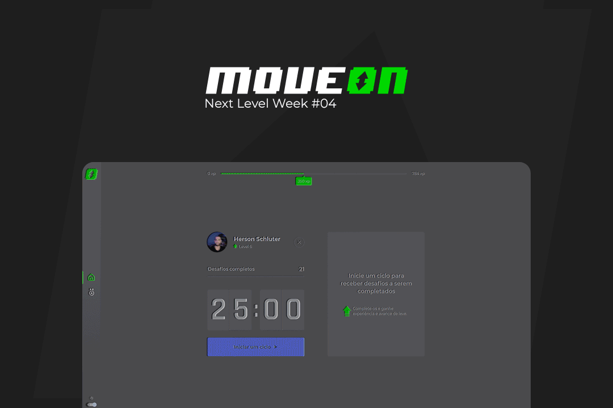

<h1 align="center">
    
</h1>
<p align="center">
  <a href="https://www.gnu.org/licenses/gpl-3.0.pt-br.html" title="License GPLv3">
    
  </a>
  
       

  

</p>
<p align="center">
  <a target="_blank" href="https://reactjs.org/">
     
  </a>

  <a target="_blank" href="https://nextjs.org/">
      
  </a>

</p>

## :bookmark_tabs: About

**Move.On** is an application based on the [Pomodoro](https://pt.wikipedia.org/wiki/T%C3%A9cnica_pomodoro) technique, aimed at developers that assists in the care of your health and posture.

System developed based on the knowledge acquired during a week of the **[&lt;nlw/&gt;#04](https://nextlevelweek.com/)** event by **[Rocketseat](https://rocketseat.com.br/)**, on the ReactJS trail taught by the famous “Fala Dev” [Diego Fernandes](https://github.com/diego3g).

<p align="center">
  <br />
  <a href="https://www.figma.com/file/ge20pu3ofMOKoliUyKx1Nl/Move.it-1.0">
    
  </a>
  <a href="https://www.figma.com/file/7tXndNnentETZjBt4MEeU3/Move.it-2.0-(Copy)?node-id=160%3A2761">
    
  </a>
  <br />
  <small>
    <em>Layouts by <a href="https://www.instagram.com/tiagoluchtenberg/" title="Instagram Tiago Luchtenberg">Tiago Luchtenberg</a></em>
  </small>
</p>


#### :computer: Preview application
[](https://nlw-move-on.vercel.app/)

## :ticket: Status
:white_check_mark: DONE SUCCESSFULLY
```bash
22 fev - Rumo ao próximo nível - #rumoaoproximonivel
23 fev - Desvendando o Next.js - #jornadainfinita
24 fev - Contexto e componentes - #focopraticagrupo
25 fev - Storage, SSR & Lambda - #neverstoplearning
26 fev - Próximo nível com React - #missioncomplete
26 fev - Acelerando sua carreira - DONE
```

## :tractor: Improvements
- Added Sign In page
- Added authentication with (Github, Google, Facebook)
- Added Leaderboard page
- Added Switch Theme Mode (Dark, Light)
- Added Sidebar
- Added PWA option in the application
- Added Toast as notification
- Added improvement in mobile notification
- Added progress bar on the Abandon cycle button
- Added share buttons (facebook, linkedin, twitter, whatsapp)
- Added new challenges
- Added new icons
- Changed Color Scheme

## :electric_plug: Technology:

- **[ReactJS](https://reactjs.org/)**
- **[NextJS](https://nextjs.org/)**
- **[TypeScript](https://www.typescriptlang.org/)**
- **[Firebase](https://firebase.google.com/?hl=pt-br)**
- **[Styled Components](https://styled-components.com/)**
- **[NextAuth](https://next-auth.js.org/)**
- **[Next PWA](https://github.com/shadowwalker/next-pwa)**
- **[React Hot Toast](https://react-hot-toast.com/)**
- **[React Icons](https://react-icons.github.io/react-icons/)**
- **[React Share](https://github.com/nygardk/react-share)**
- **[React Switch](https://github.com/markusenglund/react-switch)**
- **[Puppeteer](https://pptr.dev/)**
- **[Eslint](https://eslint.org/)**
- **[Prettier](https://prettier.io/)**

## :rocket: How to run project
Clone the project and access the folder

```bash
$ git clone https://github.com/schluters/nlw-move-on.git && cd nlw-move-on
```

Follow the steps below
```bash
# Install the dependencies
$ yarn

# Start the project
$ yarn dev

# The server will start at port:3000 - go to http://localhost:3000
```

### :memo: Settings .ENV
```bash
# BASE APP
AUTH_SECRET=""
JWT_SECRET=""
NEXTAUTH_URL="http://localhost:3000"

# FIREBASE
NEXT_PUBLIC_FIREBASE_API_KEY=""
NEXT_PUBLIC_FIREBASE_PROJECT_ID=""

# GITHUB
GITHUB_ID=""
GITHUB_SECRET=""

# GOOGLE
GOOGLE_CLIENT_ID=""
GOOGLE_CLIENT_SECRET=""

# FACEBOOK
FACEBOOK_CLIENT_ID=""
FACEBOOK_CLIENT_SECRET=""
```

## :confused: How to contribute to project

- **Fork** the project;
- Create a new branch with your changes: `git checkout -b my-feature`
- Save your changes and create a proclamation message that you made: `git commit -m "feat: My new features"`
- Submit your changes/feature: `git push origin my-feature`

> In case of doubts: [Guide on how to contribute on GitHub](https://github.com/firstcontributions/first-contributions)


## :book: License

Fully open and free code for studies and copies under license [GPLv3](/LICENSE).


## :mortar_board: Developed by

Made with :green_heart: by **Herson Schluter**

<p align="left">
  <a href="https://app.rocketseat.com.br/me/herson-schluter">
    
  </a>
  <a href="https://github.com/schluters">
    
  </a>
  <a href="https://www.linkedin.com/in/herson-schluter-3b664937/">
    
  </a>
</p>
